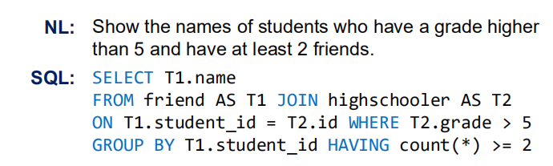

# IRNet
Code for our ACL'19 accepted paper: [Towards Complex Text-to-SQL in Cross-Domain Database with Intermediate Representation](https://arxiv.org/pdf/1905.08205.pdf)

<p align='center'>
  
</p>

## Environment Setup

* `Python3.6`
* `Pytorch 0.4.0` or higher

Install Python dependency via `pip install -r requirements.txt` when the environment of Python and Pytorch is setup.

## Running Code

#### Data preparation


* Download [Glove Embedding](https://nlp.stanford.edu/data/wordvecs/glove.42B.300d.zip) and put `glove.42B.300d` under `./data/` directory
* Download [Pretrained IRNet](https://drive.google.com/open?id=1VoV28fneYss8HaZmoThGlvYU3A-aK31q) and put `
IRNet_pretrained.model` under `./saved_model/` directory
* Download preprocessed train/dev datasets from [here](https://drive.google.com/open?id=1YFV1GoLivOMlmunKW0nkzefKULO4wtrn) and put `train.json`, `dev.json` and 
`tables.json` under `./data/` directory

##### Generating train/dev data by yourself
You could process the origin [Spider Data](https://drive.google.com/uc?export=download&id=11icoH_EA-NYb0OrPTdehRWm_d7-DIzWX) by your own. Download  and put `train.json`, `dev.json` and 
`tables.json` under `./data/` directory and follow the instruction on `./preprocess/`

#### Training

Run `train.sh` to train IRNet.

`sh train.sh [GPU_ID] [SAVE_FOLD]`

#### Testing

Run `eval.sh` to eval IRNet.

`sh eval.sh [GPU_ID] [OUTPUT_FOLD]`


#### Evaluation

You could follow the general evaluation process in [Spider Page](https://github.com/taoyds/spider)


## Results
| **Model**   | Dev <br /> Exact Set Match <br />Accuracy | Test<br /> Exact Set Match <br />Accuracy |
| ----------- | ------------------------------------- | -------------------------------------- |
| IRNet    | 53.2                        | 46.7                      |
| IRNet+BERT(base) | 61.9                          | **54.7**                      |


## Citation

If you use IRNet, please cite the following work.

```
@inproceedings{GuoIRNet2019,
  author={Jiaqi Guo and Zecheng Zhan and Yan Gao and Yan Xiao and Jian-Guang Lou and Ting Liu and Dongmei Zhang},
  title={Towards Complex Text-to-SQL in Cross-Domain Database with Intermediate Representation},
  booktitle={Proceeding of the 57th Annual Meeting of the Association for Computational Linguistics (ACL)},
  year={2019},
  organization={Association for Computational Linguistics}
}
```

## Thanks
We would like to thank [Tao Yu](https://taoyds.github.io/) and [Bo Pang](https://www.linkedin.com/in/bo-pang/) for running evaluations on our submitted models.
We are also grateful to the flexible semantic parser [TranX](https://github.com/pcyin/tranX) that inspires our works.

# Contributing

This project welcomes contributions and suggestions. Most contributions require you to
agree to a Contributor License Agreement (CLA) declaring that you have the right to,
and actually do, grant us the rights to use your contribution. For details, visit
https://cla.microsoft.com.

When you submit a pull request, a CLA-bot will automatically determine whether you need
to provide a CLA and decorate the PR appropriately (e.g., label, comment). Simply follow the
instructions provided by the bot. You will only need to do this once across all repositories using our CLA.

This project has adopted the [Microsoft Open Source Code of Conduct](https://opensource.microsoft.com/codeofconduct/).
For more information see the [Code of Conduct FAQ](https://opensource.microsoft.com/codeofconduct/faq/)
or contact [opencode@microsoft.com](mailto:opencode@microsoft.com) with any additional questions or comments.


#  论文解读

### **Abstract**

争对复杂的跨域文本到SQL，我们提出了一种称为**IRNet**的神经网络方法。

 IRNet旨在解决**两个问题**：

- 自然语言（NL）中表达的意图与SQL中的实现细节之间不匹配；
- 由大量域外单词引起的预测列的挑战。 

IRNet 不是端到端地合成一个 SQL 查询，而是将合成过程分解为**三个阶段**。

- 第一阶段，IRNet 对一个问题和一个数据库模式进行模式链接
- 第二阶段，IRNet 采用基于语法的神经模型来合成 SemQL 查询，该查询是我们设计用来连接 NL 和 SQL 的中间表示。
- 第三阶段，IRNet 通过领域知识从合成的 SemQL 查询中推理出一个 SQL 查询。

在具有挑战性的文本到 SQL 基准 Spider 上，IRNet 实现了 46.7%的准确率， 相对于之前的SOTA方法获得了 19.5%的绝对改进。在撰写本文时，IRNet 在 Spider 排行榜上获得了第一 名。



图1 Spider基准测试中的一个示例，用于说明NL中表达的意图与SQL中的实现细节之间的不匹配。问题中未提及要在SQL查询中分组的`学生ID`列。 

### 1 导言

近年来，人们对**Text-to-SQL**(即从一个问题中合成一个 SQL 查询)重新产生了浓厚的兴趣。 先进的神经方法以端到端的方式合成 SQL 查询，并在公共文本到 SQL 基准上实现超过 80%的精确匹配精度。 然而，Yu等（2018c）在最新发布的跨域`Text-to-SQL`基准[Spider]( https://yale-lily.github.io/spider )上显示了最新方法的性能不令人满意。 

对于最先进的应用 Spider 基准带来了新的挑战，这对于现有的方法来说是很难的。首先，Spider 中的 SQL 查询包含嵌套 查询和子句，如 `GROUPBY` 和 `HAVING`，这些查询和子句比另一个研究得很好的跨域基准— wikiSQl 中的查询和子句要复杂得多(钟等，2017)。考虑图 1 中的例子，问题中从来没有提到要在 SQL 查询中分组的“学生 id”列。事实上，在 SQL 中引入 GROUPBY 子句是为了方便聚合函数的实现。然 而，最终用户很少考虑这些实施细节，因此很少在问题中提及。这给现有的端到端神经方法在缺乏详细 规范的情况下合成 SQL 查询带来了严峻的挑战。这一挑战本质上源于这样一个事实，即 SQL 是为了有 效地查询关系数据库而设计的，而不是为了表示 NL 的含义(Kate，2008)。因此，在自然语言中表达的 意图和在 SQL 中实现的细节之间不可避免地存在不匹配。我们认为这个挑战是一个不匹配的问题。 

其次，由于 Spider 的跨域设置，存在大量的域外(OOD)单词。例如，开发集的数据库模式中有 35%的单词没有出现在 Spider 的训练集的模式中。相比 之下，维基百科中的数字只有 22%。在预测 SQL 查询中的列时，大量的 OOD 字带来了另一个严峻的挑 战(于等，2018b)，因为 OOD 字在神经模型中通常缺乏准确的表示。我们把这个挑战视为词汇问题。

在这项工作中，我们提出了一种称为 IRNet 的神经方法，来解决不匹配问题和具有中间表示和模式链接 的词汇问题。具体来说，IRNet 不是从一个问题端到端地合成一个 SQL 查询，而是将合成过程分解为三 个阶段。在第一阶段，IRNet 对一个问题和一个模式执行一个模式链接。模式链接的目标是识别问题中 涉及的列和表，并根据问题中列的提及方式为列分配不同的类型。结合图式链接可以增强问题和图式的 表征，尤其是当测试过程中，当好词在神经模型中缺乏准确表征时。然后，IRNet 采用基于语法的神经 模型来合成 SemQL 查询，这是我们设计用来连接自然语言和 SQL 的中间表示。最后，IRNet 利用领域 知识从合成的 SemQL 查询中确定性地推断出一个 SQL 查询。

IRNet 背后的洞察力主要是受到在各种语义解析任务中成功使用中间表示和分布式控制系统的启发以及以前在设计信息检 索以将自然语言的意义表示从数据库模式和数据库管理系统中分离出来的尝试。

在具有挑战性的 Spider 基准测试(Yu 等人，2018c)中，IRNet 实现了 46.7%的精确匹配精度，比之前的 先进方法获得了 19.5%的绝对改进。在写这篇文章的时候，IRNet 在蜘蛛排行榜上获得了第一名。当用 BERT (Devlin 等人，2018 年)进行扩充时，IRNet 达到了 54.7%的准确度。此外，正如我们在前文中 所展示的学习合成 SemQL 查询而不是 SQL 查询可以极大地受益于文本到 SQL 的其他神经方法，例 如 SQLNet (Xu 等，2017)、TypeSQL (Yu 等，2018a)和 SyntaxSQLNet (Yu 等，2018b)。这样的结 果一方面证明了语义词典在连接自然语言和语言之间的有效性。另一方面，它揭示了设计一个有效的中 间表示来连接本地语言和 SQL 是一个很有前途的方向，可以用于复杂和跨域的文本到 SQL。 


### 2 方法

在这一部分，我们详细介绍了 IRNet。我们首先描述如何解决不匹配问题和中间表示和模式链接的词汇 问题。然后，我们提出了新的模型来合成 SemQL 查询。

### 2.1 中间表示

为了消除这种不匹配，我们设计了一种特定于领域的语言，称为 SemQL，它充当了本地语言和 SQL 之 间的中间表示。图 2 展示了 SemQL 的上下文无关语法。图 3 显示了一个示例性的 SemQL 查询。我们 将在下面详细介绍 SemQL 的设计。 

受 lambda 分布式控制系统(梁，2013)的启发，SemQL 设计为树形结构。这种结构一方面可以有效地限 制合成过程中的搜索空间。另一方面，鉴于 SQL 的树形结构性质(于等，2018bYin 和 Neubig，2018)，遵循相同的结构也使得更容易直观地翻译成 SQL。

不匹配问题主要是由 SQL 查询中的实现细节和第 1 节中讨论的问题中的遗漏规范引起的。因此，在中间 表示中隐藏实现细节是很自然的，这形成了 SemQL 的基本思想。考虑到图 3 中的例子，SQL 查询中的 GROUPBY、HAVING 和 FROM 子句在 SemQL 查询中被删除，而 WHERE 和 HAVING 中的条件 在 SemQL 查询中的 Filter 的子树中被统一表示。在随后的推理阶段，可以利用领域知识从 SemQL 查询 中确定性地获取实现细节。例如，一个 SQL 查询的 GROUPBY 子句中的一列通常出现在 SELECT 子 句中，或者它是一个表的主键，在该表中聚合函数被应用于它的一列。

此外，我们严格要求在 SemQL 中声明列所属的表。如图 3 所示，列“name”及其表“friend”是在 SemQL 查询中声明的。表的声明有助于区分模式中重复的列名。我们还为特殊列“”定义了一个表，因 为我们发现“”通常与问题中的表对齐。考虑图 3 中的示例，列“”实质上与表“friend”对齐，这在问 题中有明确提及。为“”声明一个表也有助于在下一个推理阶段推断 FROM 子句。

当从一个 SemQL 查询中推断出一个 SQL 查询时，我们基于一个假设来执行推理，即数据库模式的定义 是精确和完整的。具体来说，如果 一个列是另一个表的外键，在架构中应该声明一个外键约束。这一假设通常成立，因为它是数据库设计 中的最佳实践。在 Spider 基准测试的训练集中，超过 95%的例子都支持这个假设。这个假设构成了推论 的基础。以 SQL 查询中 FROM 子句的推理为例。我们首先确定连接模式中 SemQL 查询中所有声明的 表的最短路径(数据库模式可以表示为无向图，其中顶点是表，边是表之间的外键关系)。将路径中的所有表连接起来最终会构建 FROM 子句。补充材料提供了详细的推理过程和更多的 SemQL 查询示例。 


### 2.2 模式链接

IRNet 中的模式链接的目标是记录问题中提到的列和表，并根据问题中提到的列的方式为它们分配不同 的类型。模式链接是文本到 SQL 上下文中实体链接的实例化，其中实体是指数据库中的列、表和单元格 值。我们使用一个简单而有效的基于字符串匹配的方法来实现链接。在下文中，我们基于数据库中单元 格值不可用的假设，详细说明了 IRNet 如何执行模式链接。 

总体而言，我们定义了一个问题中可能提到的三种类型的实体，即表、列和值，其中值代表数据库中的 单元格值。为了识别实体，我们首先列举一个问题中长度为 1-6 的所有 n-grams。然后，我们按照长度的降序来列举它们。如果一个 n-gram 与列名完全匹配，或者是列名的子集，我们将这个 n-gram 识别为 列。表的识别遵循同样的方式。如果一个 n-gram 既可以被识别为列又可以被识别为表，那么我们就对列 进行优先排序。如果一个 n-gram 以单引号开始和结束，我们将其视为值。一旦识别出一个 n-gram，我 们将重新移动与之重叠的其他 n-gram。为此，我们可以识别出一个问题中提到的所有实体，并通过将这 些识别出的 n-gram 和剩余的 n-gram 连接起来，获得该问题的非重叠 n-gram 序列。我们将序列中的每 一个 n-gram 称为一个跨度，并指定每个跨度 。

[img](src='')

图 4:合成 SemQL 查询的神经模型概述。基本上，IRNet 由一个本地语言编码器、一个模式编码器和一 个解码器组成。如图所示，从模式中选择“图书标题”列，而从内存中选择第二列“年份”。

根据实体跨越类型。例如，如果跨度被识别为 column，我们将为其分配一个列类型。图 4 描述了一个问 题的模式链接结果。

对于那些被识别为列的跨度，如果它们与模式中的列名完全匹配，我们为这些列分配一个类型“精确匹 配”，否则分配一个类型“部分匹配”。为了将单元格值与模式中相应的列相链接，我们首先查询概念 网(Speer 和 Havasi，2012)中的值跨度，该概念网是一个开放的大规模知识图，并在模式上搜索概念网 返回的结果。我们只考虑概念网的两类查询结果，即“是一种类型”和“相关术语”，因为我们观察到单元格值所属的列通常出现在这两类中。如果存在与模式中的列名完全或部分匹配的结果，我们将该列 标记为类型“值完全匹配”或“值部分匹配”。 

### 2.3 模型

我们提出了合成 SemQL 查询的神经模型，它以一个问题、一个数据库模式和模式链接结果作为输入。 图 4 通过一个示例描述了模型的整体架构。

为了解决词法问题，我们在为模式中的问题和列构造表示时考虑了模式链接结果。此外，我们还设计了 一个记忆指针网络，用于在合成过程中选择列。当选择一列时，它使首先决定是否从内存中进行选择，这使它有别于普通的指针网络(Vinyals 等人，2015)。记忆增强指针网 

络的动机是普通指针网络倾向于根据我们的观察选择相同的列。NL 编码器。让 x=[(x1，τ1)， (x1，τL)]去注意一个问题的非重叠跨度序列，其中 xi 是第 I 个跨度，τi 是 xi 在模式链接中指定的跨度类 型。NL 编码器以 x 为输入，将 x 编码成一系列隐藏状态 Hx。xi 的每个单词被转换成它的嵌入向量，并 且它的类型 τi 也被转换成嵌入向量。然后，NL 编码器将类型和单词嵌入的平均值作为跨度嵌入值。最 后，NL 编码器在所有跨度嵌入值上运行双向 LSTM(Hochreter 和 Schmidhuber，1997)。前向和后向 LSTM 的输出隐藏状态被连接以构建 Hx。模式编码器。让 s=(c，t)表示一个数据库模式，其中 c={(c1，φi)，(cn，φn)}是一组不同的列及其类型，我们在模式链接中对其进行签名，t={t1，，tm}是 一组表。模式编码器将 s 作为列 Ec 和表 Et 的输入和输出表示。下面我们以列表示为例。表表示的构造 遵循相同的方式，除了我们不在模式链接中将类型分配给表。 具体来说，ci 中的每个词首先被转换成其嵌入向量，其类型 φi 也被转换成嵌入向量 ϕi作为列的初始表示。模式编码器进一步关注跨度嵌入并获得上下文向量。最后，模式编码器将初始嵌入、上下文向量和类型嵌入的总和作为列表示。列 c i 的表示计算如下。 

解码器。解码器的目标是合成大小为 SemQL 的查询。给定 SemQL 的树结构，我们使用基于语法的解 码器(Yin 和 Neubig，2017，2018)，该解码器利用通过动作的顺序应用来建模 SemQL 查询的生成过程。 形式上，SemQL 查询 y 的生成过程可以形式化如下。其中 ai 是在时间步骤 I 采取的动作，a<i 是在 I 之前的动作序列，T 是整个动作序列的总时间步骤数。 

解码器与三种类型的操作交互以生成一个 SemQL 查询，包括应用规则、选择列和选择表。 APPLYRULE(r)将生产规则 r 应用于 SemQL 查询的当前派生树。选择列(c)和选择表(t)分别从模式中选 择列 c 和表 t。在这里，我们详细介绍了“选择 UMN”和“选择表格”这两个动作。有兴趣的读者可以参 考尹和东大(2017)的行动申请的细节。 

我们设计了一个内存扩充的指针网络来实现 SELECTCOLUMN 动作。存储器用于记录选定的列，这类 似于梁等人(2017)中使用的存储器机制。当解码器将要选择一列时，它首先决定是否从存储器中选择， 然后基于该决定从存储器或模式中选择一列。一旦选择了列，它将从架构中删除 其中，S 表示从模式中选择，MEM 表示从内存中选择，vi 表示通过关注 Hx 获得的上下文向量，Em c 表示在内存中嵌入列，Es c 表示从未被选择的列的嵌入。wm 是可训练参数。 

当谈到选择表时，解码器通过指针网络从模式中选择一个表 t:

如图 4 所示，解码器首先预测一列，然后预测它所属的表。为此，我们可以利用列和表之间的关系来删 除不相关的表。 

从粗到细。我们进一步采用由粗到细的框架(太阳能-莱萨马，2008；Bornholt 等人，2016 年；Dong 和 Lapata，2018)，将 SemQL 查询的解码过程分解为两个阶段。在第一阶段，骨架解码器输出一个 SemQL 查询的骨架。然后，去尾解码器通过选择列和表来填充骨架中缺失的细节。补充材料提供了对 SemQL 查询框架和从粗到细框架的详细描述。 


## 3 实验

在本节中，我们通过将 IRNet 与最先进的方法进行比较来评估 IRNet 的有效性，并对 IRNet 中的几个设 计选择进行删减，以了解它们的贡献。 

### 3.1 实验设置

数据集。我们在 Spider (Yu 等人，2018c)上进行实验，Spider 是一个大规模的、人工注释的、跨域的文 本到 SQL 基准。继于等(2018b)，我们使用 数据库分为评估数据库，其中 206 个数据库分为 146 个培训数据库、20 个开发数据库和 40 个测试数据 库。有 8625、1034、2147 个问题-SQL 查询对用于培训、开发和测试。就像任何竞争基准一样， Spider 的测试集是不公开可用的，我们的模型被提交给数据所有者进行测试。我们使用于等人(2018c)提 出的 SQL 精确匹配和成分匹配来评估 IRNet 和其他方法。基线。我们还评估了由神经注意机制(Bahdanau 等人，2014 年)和复制机制(Gu 等人，2016 年)、SQLNet(徐等人，2017 年)、TypeSQL(于等人， 2018 年 a)和 SyntaxSQLNet(于等人，2018 年 b)组成的序列到序列模型(Sutskever 等人，2014 年)。 

实现。我们用 PyTorch 实现了 IRNet 和基线方法(Paszke 等人，2017)。单词嵌入的维度、类型 embeddings 和隐藏向量被设置为 300。单词嵌入是用手套初始化的(Penning-ton 等人，2014)，并在 NL 编码器和模式编码器之间共享。它们在训练中是固定的。动作嵌入和节点类型嵌入的维度分别设置为 128 和 64。辍学率为 0.3。我们使用带默认超参数的 Adam (Kingma 和 Ba，2014)进行优化。批量设置 为 64。

伯特。语言模型预训练已被证明对学习通用语言表示是有效的。为了进一步研究我们方法的有效性，受 SQLova (Hwang 等人，2019)的启发，我们利用 BERT (Devlin 等人，2018)对问题、数据库模式和模式链接结果进行编码。解码器与 IRNet 中的相同。具体来说，问题中的跨度序列与模式中所有不同的列 名连接在一起。每个列名用一个特殊的标记[·塞普分开。BERT 将串联作为输入。问题中一个跨度的表示 被视为其单词和类型的平均隐藏状态。为了构造列的表示，我们首先对其单词的隐藏状态进行双向 LSTM(双向 LSTM)运算。然后，我们将它的类型嵌入和 BI-LSTM 的最终隐藏状态之和作为列表示。 表表示的构造遵循相同的方式。补充材料提供了一个图表-

### 实验结果 

表 1 给出了 IRNet 与开发集和测试集的各种基线的精确匹配精度。IRNet 显然大大超过了所有基线。在 测试集上，它比 SyntaxSQLNet 获得了 27.0%的绝对改进。与执行大规模数据扩充的 SyntaxSQLNet(增强版)相比，它还获得了 19.5%的绝对改进。当引入 BERT 时，SyntaxSQLNet 和 IRNet 的性能都得到了显著提高，并且它们在开发集和测试集上的精度差距也扩大了。 

为了详细研究 IRNet 的性能，继于等人(2018b)之后，我们在测试中测量了不同的 SQL 组件的平均 F1 分数 集合。我们比较了语法网和信息检索网。如图 5 所示，IRNet 在所有组件上都优于 SyntaxSQLNet。除 了关键字，每个组成部分至少有 18.2%的绝对改进。当引入 BERT 时，IRNet 在每个组件上的性能进一 步提高，尤其是在 WHERE 子句中。

根据于等人(2018c)定义的 SQL 的硬度水平，我们进一步研究了 IRNet 在测试集的不同部分上的性能。 如表 2 所示，无论有无 BERT，IRNet 在所有四个硬度级别上都显著优于 SyntaxSQLNet。例如，与 SyntaxSQLNet 相比，IRNet 在硬水平上获得了 23.3%的绝对提高。

表 2:通过硬度水平在测试集上的语法查询-网络、语法查询网络(BERT)、语法查询网络和语法查询网络 (BERT)的精确匹配精度。 

为了研究 SemQL 的有效性，我们改变了基线方法，让他们学习生成 SemQL 查询而不是 SQL 查询。如 表 3 所示，开发集精确匹配的准确度至少有 6.6%到 14.4%的绝对提高。例如，当语法查询网络被学习来 生成 SemQL 查询而不是 SQL 查询时，它记录了 8.6%的绝对改进，甚至优于执行大规模数据扩充的语 法查询网络。TypeSQL 和 SQLNet 的相对有限的改进是因为它们基于槽填充的模型只支持 SemQL 查询 的子集。显著的改进，一方面，证明了 SemQL 的有效性。另一方面，它表明设计一个中间表示来连接 本地语言和 SQL 在文本到 SQL 中是有前途的。

### 3.3消融研究

我们在IRNet和IR-Net(BERT)上进行消融研究，以分析每个设计选择的贡献。具体来说，我们首先评估一 个不应用模式链接和由粗到细框架的基本模型，并替换 

记忆增强指针网络(MEM)与普通指针网络(Vinyals 等人，2015)。然后，我们逐渐将每个组件应用到基 本模型上。消融研究在开发环境中进行。 

表 4 给出了消融研究结果。很明显，我们的基本模型在形式上明显优于语法查询网、语法查询网和语法 查询网。在 IRNet 和 IRNet(BERT)上执行模式链接(“+SL”)带来了 8.5%和 6.4%的绝对改善。在 WHERE 子句中预测列是有挑战性的(Yavuz 等人，2018)。当 IRNet 执行模式链接时，WHERE 子句 的 F1 得分增加了 12.5%。显著的改进证明了图式连接在解决词汇问题上的有效性。使用内存增强的指针 网络(“+MEM”)进一步提高了 IRNet 和 IRNet 的性能。我们观察到普通指针网络在合成过程中倾向于选 择相同的列。当使用存储器扩充指针网络时，遭受这个问题的例子的数量减少了 70%。最后，采用由粗 到细的框架(“+CF”)可以进一步提高性能。 

### 3.4 误差分析

为了理解错误的来源，我们在开发集上分析了 483 个 IRNet 失败的例子。我们确定了失败的三个主要原 因:列预测。我们发现 32.3%的失败示例是由基于单元格值的不正确列预测造成的。也就是说，问题中没 有提到正确的列名，但是提到了属于它的单元格值。正如研究指出的那样(Yavuz 等人，2018 年)，数据 库的单元值对于解决这个问题至关重要。15.2%的失败示例未能预测出部分出现在问题中或以同义词形 式出现的正确列。通过将我们基于字符串匹配的方法与基于嵌入匹配的方法相结合(Krishnamurthy 等人， 2017 年)，可以进一步解决这种失败，从而在未来改进模式链接。嵌套查询。23.9%的失败示例是由复杂 的嵌套查询引起的。这些例子中的大部分是在额外的困难水平。在当前的训练集中，超硬级别的查询数 (20%)最少，甚至少于简单级别的查询数(23%)。鉴于复杂的 SQL 查询的搜索空间非常大，数据增强技 术可能是不可或缺的。 

接线员。12.4%的失败例子误导了操作者，因为它需要共同的知识来预测正确的例子。考虑到以下问题， “找出会员级别高于 4 的访问者的姓名和会员级别，并按年龄从老到幼进行排序”，短语“从老到幼” 表示排序应以降序进行。这里定义的运算符包括聚合函数、WHERE 子句中的运算符和排序顺序(ASC 和 DESC)。

其他失败的例子不容易归类为上述类别之一。其中一些是由不正确的 FROM 子句引起的，因为基本事实 SQL 查询连接那些在模式中没有定义外键关系的表。这违背了我们的假设，即数据库模式的定义应该是 精确和完整的。

当与 BERT 结合使用时，30.5%的失败例子是固定的。其中大部分是在分类列预测和操作中，但是对嵌 套查询的改进是非常有限的。 

## 4 讨论

绩效差距。在 IRNet 上，开发集和测试集之间存在性能差距，如表 1 所示。考虑到 SQL 中嵌套查询的过 度组合和有限的数据量(开发中为 1034，测试中为 2147)，这一差距可能是由硬和额外级别中 SQL 查询 的不同分布造成的。为了验证这一假设，我们从官方训练集中构造了一个伪测试集。我们在训练集中的 剩余数据上训练 IRNet，并分别在开发集和伪测试集上评估它们。我们发现，尽管伪集与开发集具有相 同数量的复杂 SQL 查询(硬和超硬)，但仍然存在性能差距。其他方法没有表现出性能差距，因为它们在 复杂的 SQL 查询上的性能相对较差。例如，在测试集的超硬级别中，语法查询只实现了 4.6%。补充材 料提供了关于伪测试集的详细实验设置和结果。SemQL 的局限性。我们的中间表示法有一些局限性。首 先，它不支持 SQL 的 FROM 子句中的自联接。为了支持自连接，lambda 演算中的变量机制(Carpenter，1997)或话语表征结构中的范围机制(Kamp 和 Reyle，1993)可能是必要的。其次，SemQL 还没有 完全消除本地语言和 SQL 之间的不匹配。例如，SQL 中的 INTERSECT 子句经常用来表示不相交的条 件。然而，当指定需求时，最终用户很少关心两个条件是否脱节。尽管 SemQL 存在局限性，但实验结 果证明了它在文本到 SQL 转换中的有效性。为此，我们认为设计一个有效的中间表示来连接本地语言和 SQL 是一个很有前途的方向，可以用于复杂和跨域的文本到 SQL。我们把更好的中间表现作为我们未来 的作品之一。 

## 5 相关工作

数据库的自然语言接口。自 20 世纪 70 年代以来，自然语言数据库接口的任务受到了极大的关注(沃伦和 佩雷拉，1981；Androut-sopoulos 等人，1995 年；Popescu 等人，2004 年；哈利特， 2006 年；乔尔达尼和莫奇蒂，2012 年)。大多数早期提出的系统都是手工制作的特定数据库(沃伦和佩雷 

拉，1982；伍兹，1986 年；Hendrix 等人，1978)，使得适应跨域设置变得困难。后来的工作集中在构建一个系统，它可以用最少的人工 efforts 为多个数据库重用(Grosz 等人，1987；Androutsopoulos 等 人，1993 年；唐和穆尼，2000)。最近，随着语义分析的高级神经方法的发展和诸如 WikiSQL(钟等， 2017)和 Spider(于等，2018c)的大规模、跨域文本到 SQL 基准的发布，对该任务重新产生了兴趣(徐等， 2017；Iyer 等人，2017 年；孙等，2018；Gur 等人，2018 年；于等，2018a，b；王等，2018； FineganDollak 等人，2018 年；Hwang 等人，2019 年)。与这些端到端合成 SQL 查询的神经方法不 同，IRNet 首先合成 SemQL 查询，然后从中推断出 SQL 查询。 

NLIDB 中的中间表示。早期提出的系统如 LUNAR (Woods，1986)和 MASQE(Anroutsopoulos 等人， 1993)也提出了中间表示(IR)来表示问题的含义，然后将它转换成 SQL 查询。这些 IRs 中的谓词是为一 个特定的数据库设计的，它将 SemQL 区分开来。SemQL 的目标是广泛采用，当它在一个新的领域中使 用时，不需要人工努力。李和 Jagadish (2014)在他们的 NLIDB 系统中提出了一个查询树来表示问题的 含义，它主要用作用户和他们的系统之间的交互媒介。 

实体链接。执行模式链接背后的洞察力部分受到在知识库问答和语义解析中成功结合实体链接的启发 (Yih 等人，2016；Krishnamurthy 等人，2017 年；于等，2018aHerzig 和 Berant，2018；Kolitsas 等 人，2018 年)。在语义分析的背景下，Krish-namurthy 等人(2017)提出了一个神经实体链接模块，用于 回答半结构化表上的组合问题。TypeSQL (Yu 等人，2018a)提出利用类型信息来更好地理解问题中罕见 的实体和数字。与 TypeSQL 相似，IRNet 也能识别问题中提到的列和表。IRNet 与众不同的地方在于， IRNet 根据问题中提到的不同类型为列分配不同的类型。

## 6 结论 

我们提出了一种面向复杂和跨领域文本到 SQL 的神经方法 SemQL，旨在解决词汇问题和模式链接和中 间表示的不匹配问题。在具有挑战性的 Spider 基准上的实验结果证明了 IRNet 的有效性。


感谢 

### 7 补充材料

### 7.1 SemQL 查询示例

图 10 展示了更多的 SemQL 查询示例。 

### 7.2 SQL 查询的推理 

为了从 SemQL 查询中推断出一个 SQL 查询，我们以预定的顺序遍历树形结构的 SemQL 查询，并根据 应用于它的生成规则将每个树节点映射到相应的 SQL 查询组件。 应用于 Z 节点的生产规则说明了 SQL 查询是否具有以下组件之一:UNION、EXCEPT 和INTERSECT。R 节点代表单个 SQL 查询的开始。应用于 R 的产生式规则表示该查询是否有 WHERE 子句和 ORDERBY 子句。应用于选择节点的生产规则表示选择子句有多少列。每个节点表示一个列/聚 合函数对。具体来说，A 下的节点表示聚合函数、列名和列的表名。节点最高级和最高级下的子树被映 射到 SQL 查询中的 ORDERBY 子句。应用于筛选器的生成规则表示 SQL 查询中的不同条件运算符， 例如 and、or、>、<、=、in、not in 等。如果在过滤器节点下有一个 A 节点，并且它的聚合函数不 None，那么它将在 HAVING 子句中被填充，否则在 WHERE 子句中被填充。如果过滤器节点下有一个 R 节点，我们将在 R 节点上递归地重复这个过程，并返回一个嵌套的 SQL 查询。FROM 子句通过识别 模式中连接这些表的最短路径，从 SemQL 查询中选择的表中生成(数据库模式可以表示为无向图，其中 顶点是表，边是表之间的关系)。最后，如果在 SemQL 查询中存在一个应用于列的聚合函数，那么在SQL 查询中应该有 GROUPBY 子句。在大多数情况下，要分组的列出现在 SELECT 子句中，或者它 是表的主键，在该表中，聚合函数应用于其中一列。 

### 7.3 将 SQL 转换为 SemQL 

为了从一个 SQL 查询生成一个 SemQL 查询，我们首先初始化一个 Z 节点。如果 SQL 查询有一个组件 UNION，EXCEPT 和 INTERSECT，我们在 Z 下附加相应的关键字和两个 R 节点，否则一个单 R 节 点。然后，我们在 R 下附加一个选择节点，Select 子句中的列数决定了选择节点下的 A 节点数。如果一 个查询中的 OrderBY 子句包含一个 LIMIT 关键字，它将被转换成一个最高级节点，否则就是一个 ORDER 节点。接下来，过滤器节点的子树由 WHERE 和 HAVING 子句中的条件决定。如果在 WHERE 子句或 HAVING 子句中有嵌套查询，我们递归地处理子查询。对于一个 SQL 查询中的每一列， 我们将它的聚合函数节点、一个 C 节点和一个 T 节点附加在一个 

图 6:图 3 中显示的 SemQL 查询的框架 

节点 C 附加列名，节点 T 附加其表名。对于特殊列“”，如果在 FROM 子句中只有一个表不属于任何 

列，我们将为其分配列“*”，否则，我们将表名手动标记为“”。如果 FROM 子句中的表没有被签名到 

任何列，它将被转换为条件为的筛选器节点下的子树。这样，一个 SQL 查询就可以成功地转换成一个 

SemQL 查询。

### 7.4 由粗到细的框架 

SemQL 查询的框架是通过移除每个 A 节点下的所有节点获得的。图 6 显示了图 3 中所示的 SemQL 查 

询的框架。 图 7 描述了从粗到细的框架来合成一个 SemQL 查询。在第一阶段，骨架解码器输出 SemQL 查询的骨 架。然后，细节解码器通过选择列和表来填充骨架中缺失的细节。在由粗到细的框架中生成一个 SemQL 查询 y 的概率被形式化如下。 

## 7.6 开发集和测试集之间的性能差距分析

为了验证我们的假设，即性能差距是由硬和超硬级别中的不同 SQL 查询分布引起的，我们首先从 Spider 基准的官方训练集中构造一个伪测试集。然后，我们在伪测试集和官方开发集上进行了进一步的实验。 具体来说，我们从训练集中抽取 20 个数据库来构建一个伪测试集，它与开发集具有相同的硬度分布。然 后，我们在剩余的训练集上训练 IRNet，并分别在开发集和伪测试集上评估它。我们对训练集中的伪测 试集进行了三次抽样，得到了三个伪测试集，即伪测试 A、伪测试 B 和伪测试 C，它们分别包含 1134、1000 和 955 个测试数据。 

表 5 给出了三个伪测试集和官方开发集的硬度分布。图 9 显示了开发集和训练期间每个时期之后的三个 伪测试集上的 SQL 的精确匹配精度。IRNet 在开发集和伪集 C 上有竞争力的表现(图 9c)，但是在伪测试 A 和 B 上有明显的性能差距(图 9a 和图 9b)。虽然开发集和三个伪集之间的硬度分布几乎相同，但是数据 分布仍然有一些差异，这导致了性能差距。 

我们进一步研究了 SyntaxSQLNet 在开发集和伪测试 a 上的性能差距。如表 6 所示 

